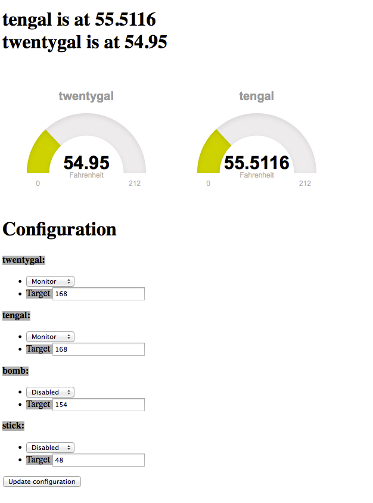

drunken-control
===============

Software to control heating elements in a home brewery


Requirements
============

Needs a ramdisk to store current information. Add the following to /etc/fstab
```
tmpfs           /mnt/ramdisk    tmpfs   size=1M,noatime,mode=1777       0       0
```
Add 1wire and ic2 modules
  add the following to /etc/modules:
```
snd-bcm2835
i2c-bcm2708
i2c-dev
w1-gpio
w1-therm
```
  comment out everthing in /etc/modprobe.d/raspi-blacklist.conf
  
  
#Packages to install

unneeded, but nice on a bare raspbian:
```
sudo aptitude install vim digitemp wicd-curses wicd i2c-tools git tmux
```
required
```
sudo aptitude install python-pip python-smbus python-mysqldb
sudo pip install flask pyyaml tornado simplejson graphitesend
```
